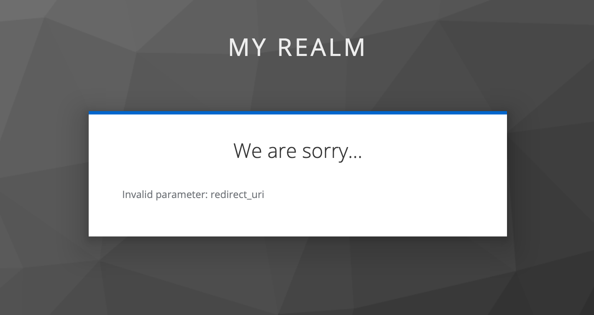

This project is an example of malicious frontend being blocked by Keycloak from authenticating.

Our malicious frontend operates at different address (port 8001 instead of 8000). As a result we see an error

